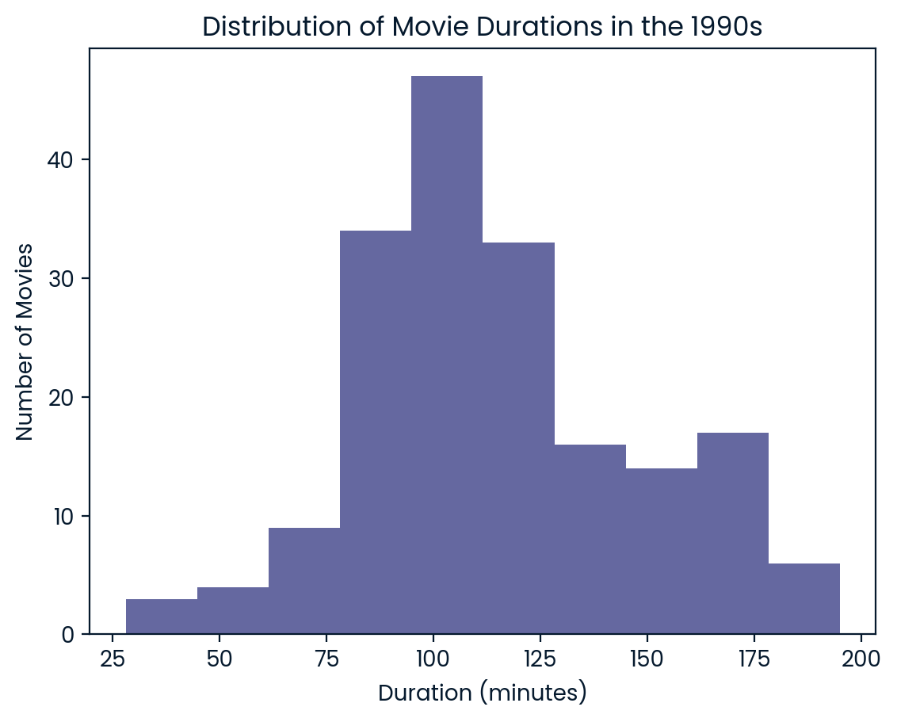

# Netflix Movie Analysis (1990s)

This project was created as part of a solution to a problem encountered during a DataCamp course. The task was to analyze Netflix data, specifically focusing on movies released in the 1990s.

## Project Description

This project involves analyzing movies from Netflix that were released in the 1990s. The main goals of the analysis are:

- To explore the distribution of movie durations.
- To filter movies by genre (in this case, Action movies).
- To count how many short action movies (those with a duration of less than 90 minutes) were released during the 1990s.

## Requirements

The project requires the following Python libraries:

- `pandas`: For data manipulation and analysis.
- `matplotlib`: For data visualization.

## Acknowledgments

This project was created as part of a DataCamp course to practice data analysis and manipulation techniques using Python.

© mdkhademali
